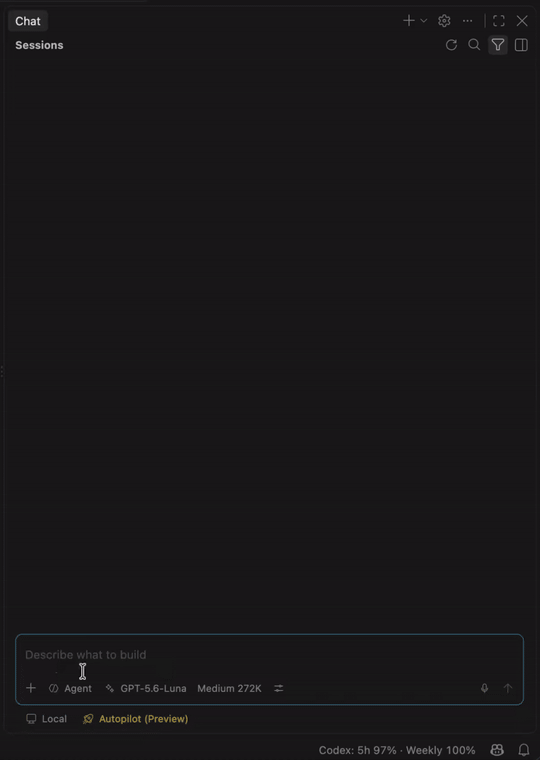

<div align="center">
  

  <h1>Codex For Copilot</h1>

  <p><strong>Use your Codex models directly inside VS Code Chat and Agent mode.</strong></p>

  <p>
    <a href="https://marketplace.visualstudio.com/items?itemName=Gaussian.gaussian-codex-for-copilot">
      
    </a>
  </p>
</div>

Codex For Copilot is a lightweight VS Code Language Model Provider that connects VS Code Chat to the ChatGPT Codex Responses backend. Select **Codex** from the model picker and keep the native VS Code experience for chat, tools, confirmations, workspace trust, and extensions.

## Highlights

- **Native VS Code integration** — works in Chat and Agent mode through the standard model picker.
- **Automatic model discovery** — exposes available upstream Codex models with configurable fallbacks.
- **Fast streaming transport** — supports reusable WebSocket sessions with HTTP fallback.
- **VS Code tool support** — forwards built-in, extension, and MCP tool calls through the Responses API.
- **Hosted Web Search** — optionally gives Codex live web access through OpenAI's native Responses tool, with clickable sources.
- **Optional Native Tool Search** — lets compatible Codex models search selected Agent tools on demand when you explicitly enable it.
- **Conversation continuity** — reuses compatible response branches for efficient follow-up turns.
- **Usage visibility** — shows available account limits or Credits in the status bar when supplied by the backend.

## See it in VS Code

<p align="center">
  
</p>

## Get started

### 1. Install

Install the extension from the [VS Code Marketplace](https://marketplace.visualstudio.com/items?itemName=Gaussian.gaussian-codex-for-copilot).

### 2. Add credentials

Open the Command Palette and choose one of the following:

- **`Codex for Copilot: Sign in with ChatGPT`** for the normal browser-based login flow.
- **`Codex for Copilot: Sign in with Device Code`** when a loopback browser callback is unavailable.
- **`Codex for Copilot: Import Codex auth.json`** to import existing Codex CLI ChatGPT credentials.
- **`Codex: Set API Key`** to store an API key in VS Code SecretStorage.

The extension stores imported and signed-in ChatGPT credentials in VS Code SecretStorage and refreshes them automatically, including refresh-token rotation. Importing copies the credentials and never writes to the original `~/.codex/auth.json` file; signing out of an imported credential only removes the extension's copy. The direct `~/.codex/auth.json` fallback remains read-only.

### 3. Select Codex

Open VS Code Chat, choose **Codex** from the model picker, and start chatting or using Agent mode.

To give a request live web access, enable **Web Search** in the Chat tools picker or reference `#webSearch` in the prompt. The Codex backend executes the search directly; the extension does not expose it as a VS Code function call.

Web Search settings under **Settings → Extensions → Codex** let you choose live or cached access, search context size, and an optional domain allowlist. You can also choose whether Chat shows compact statuses, search/open/find actions, or actions with clickable source pages.

## Tool discovery

The extension uses **VS Code Virtual Tool Groups by default**. VS Code organizes selected Agent tools into groups and reveals a group when the model needs it.

**Native Tool Search is optional.** When enabled, it temporarily disables VS Code Virtual Tool Groups and instead lets the Codex backend search the selected tool catalog and load matching tools on demand. Both methods solve the same problem—avoiding loading every tool into the model at once—but VS Code performs the grouping in the default mode, while Codex performs the search in Native Tool Search mode.

Use **`Codex: Enable Native Tool Search`** to opt in. The extension saves the previous VS Code grouping setting. Use **`Codex: Use VS Code Virtual Tool Groups`** to disable Native Tool Search and restore that setting. Tool execution, confirmation, workspace trust, and permissions remain handled by VS Code in both modes.

Hosted Web Search is independent from Native Tool Search. It remains available when Native Tool Search is disabled and is only combined with selected client tools in the final Responses API `tools` array.

## Requirements

- VS Code 1.104.0 or newer.
- A ChatGPT sign-in, imported Codex CLI `auth.json`, or API key.

## Common commands

- `Codex: Manage`
- `Codex: Open Settings`
- `Codex: Open Logs`
- `Codex: Refresh Account Limits`
- `Codex: Enable Native Tool Search`
- `Codex: Use VS Code Virtual Tool Groups`
- `Codex: Show Native Tool Search Status`
- `Codex for Copilot: Sign in with ChatGPT`
- `Codex for Copilot: Add Codex Account`
- `Codex for Copilot: Switch Codex Account`
- `Codex for Copilot: Remove Codex Account`
- `Codex for Copilot: Sign in with Device Code`
- `Codex for Copilot: Import Codex auth.json`
- `Codex for Copilot: Show Auth Status`
- `Codex for Copilot: Sign Out (All Accounts)`

## Diagnostics and privacy

Use **Codex: Open Logs** to view the extension's structured VS Code log channel. Each model request, authentication flow, model discovery operation, and account-limit refresh receives an `operationId`; search for that value to follow one operation through retries, WebSocket fallback, and completion.

The channel follows VS Code's native log level. Use **Developer: Set Log Level...** and select the Codex channel to enable Debug or Trace detail when investigating a problem.

Logs never include prompt or instruction text, reasoning, tool arguments/results, credentials, cookies, or Turn State. They retain only safe counts, sizes, hashes, identifiers hashed for correlation, transport decisions, and redacted error metadata.

## Configuration

Most users can keep the defaults. Advanced settings are available under **Settings → Extensions → Codex**, including:

- credential source
- backend URL
- HTTP or WebSocket transport
- fallback model and model visibility
- reasoning effort and service tier
- request compression and WebSocket prewarming
- Web Search access, context, domains, and status detail

For a proxy-required network, set VS Code's `http.proxy` setting or the Extension Host's `HTTPS_PROXY`/`HTTP_PROXY` environment variable. The provider applies that proxy consistently to model discovery, account usage, HTTP Responses requests, token counting, and WebSocket requests; `NO_PROXY` remains honored.

## Develop locally

```bash
npm install
npm run compile
```

Press `F5` in VS Code to launch an Extension Development Host.

Useful checks:

```bash
npm run check
npm run test:smoke
npm run test:extension-host
npm run package:vsix
```

Release and Marketplace publishing details are documented in [docs/releasing.md](docs/releasing.md).

## Remote-SSH

The extension runs in the local UI extension host so it can use credentials stored on your computer. When working over Remote-SSH, keep the extension installed locally rather than installing a second copy on the remote host.

## License

[MIT](LICENSE)
